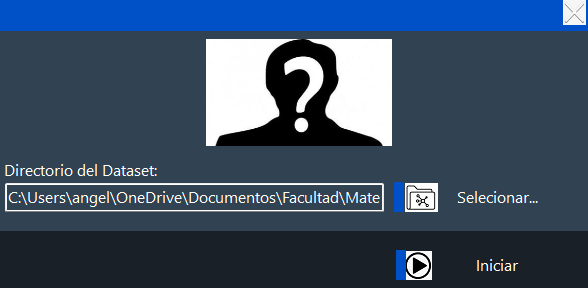
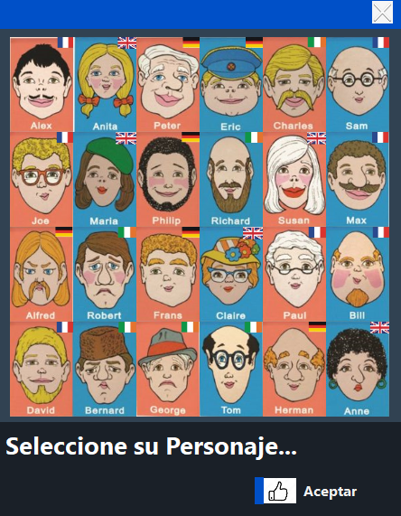
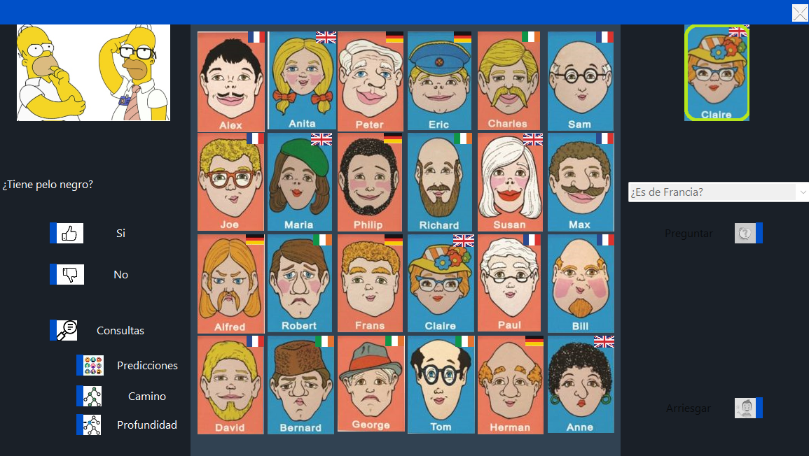

# Proyecto Final: Algoritmos de Datos y Complejidad Estructural  
**Universidad Nacional Arturo Jauretche (UNAJ) – 1° Cuatrimestre 2025**

---

## 🎮 ¿Cómo jugar?

1. **Clonar o descargar** este repositorio.  
2. Abrir la solución `WiW.sln` con Visual Studio.  
3. **Compilar** y ejecutar el proyecto.

Al iniciarse, WiW te pedirá:

1. Seleccionar el directorio donde están los **recursos** del juego.  
2. Elegir tu **personaje** de la galería mostrada.  

---

## 🕹️ Dinámica de juego

- El juego es **por turnos**.  
- En cada turno, un jugador (usuario o Bot) hace **preguntas de sí/no** para adivinar el personaje del oponente.  
- Ejemplos de preguntas:
  - “¿Es rubio?” – “No”  
  - “¿Lleva gafas?” – “No”  
  - “¿Tiene barba?” – “Sí”  

  

---

## 🤖 Estrategia del Bot

El Bot utiliza un **árbol de decisión** para optimizar sus preguntas y reducir al máximo el número de interrogantes necesarios.  
- **Clase**: `Estrategia`  
- **Función**: Construir y recorrer recursivamente un árbol binario de preguntas, filtrando candidatos hasta llegar al personaje correcto.  

